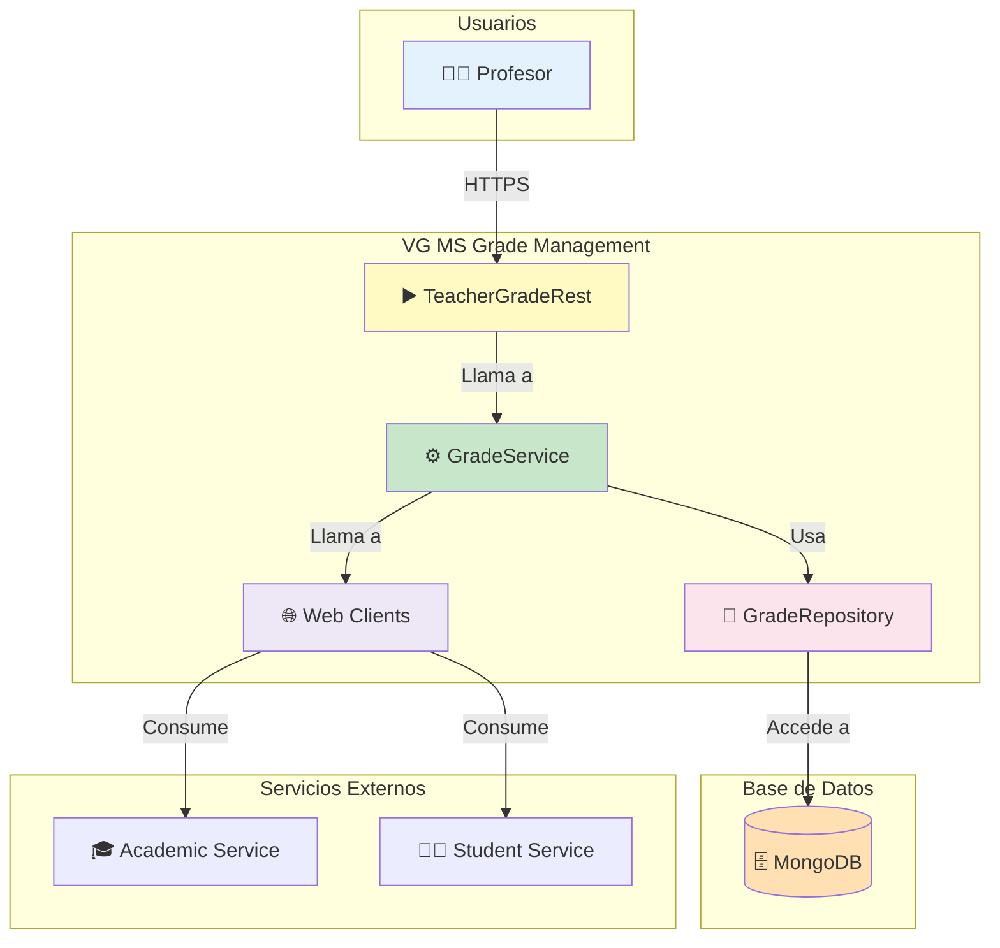
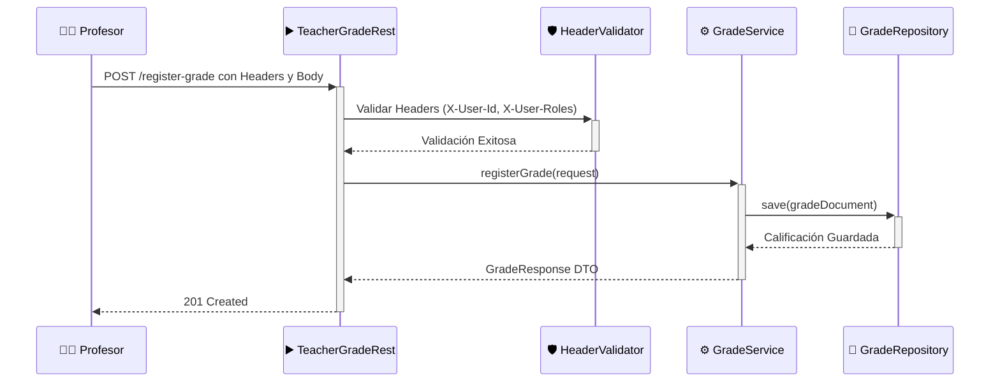

<h1 align="center">🎓 VG MS Grade Management</h1>

<p align="center">
  <strong>Un microservicio reactivo para la gestión de calificaciones escolares, enfocado en el rol del profesor y alineado con los estándares del MINEDU.</strong>
</p>

<p align="center">
  
  
  
  
  
</p>

---

## 📖 Sobre el Proyecto

**VG MS Grade Management** es un microservicio de alto rendimiento construido con Spring Boot y WebFlux, diseñado para manejar de manera eficiente el ciclo de vida de las calificaciones en un entorno educativo. La API está diseñada exclusivamente para el rol de `TEACHER`, garantizando que solo los usuarios autorizados puedan gestionar la información académica de los estudiantes.

El sistema utiliza una base de datos NoSQL reactiva (MongoDB) y sigue las mejores prácticas de la programación reactiva para ofrecer una solución escalable y resiliente.

## ✨ Características Principales

*   **Programación Reactiva**: APIs 100% no bloqueantes para un alto rendimiento y concurrencia.
*   **Rol Exclusivo para Profesores**: Endpoints seguros y dedicados para la gestión de calificaciones por parte de los docentes.
*   **Integración con Microservicios**: Comunicación con servicios externos (alumnos, cursos, etc.) a través de clientes HTTP reactivos.
*   **Validación por Headers**: Sistema de seguridad que valida el rol y la identidad del usuario a través de headers HTTP.
*   **Containerización**: Listo para ser desplegado con Docker y Docker Compose.
*   **Estándares MINEDU**: Lógica de negocio preparada para seguir las normativas del Ministerio de Educación del Perú.

## 🏗️ Arquitectura y Flujo de Datos

### Diagrama de Arquitectura

El microservicio se integra dentro de un ecosistema más grande, comunicándose con otros servicios y una base de datos, mientras expone una API segura.



### Flujo de una Petición (Sequence Diagram)

Este diagrama muestra cómo fluye una petición para registrar una nueva calificación a través del sistema.



## 🛠️ Tecnologías Utilizadas

*   **Java 17**: Lenguaje de programación.
*   **Spring Boot 3.4.9**: Framework principal.
*   **Spring WebFlux**: Para la creación de APIs reactivas.
*   **Spring Data MongoDB Reactive**: Integración reactiva con MongoDB.
*   **Maven**: Gestión de dependencias y construcción del proyecto.
*   **Lombok**: Para reducir el código repetitivo.
*   **MapStruct**: Mapeo de objetos entre capas.
*   **Docker**: Para la containerización.

## 🚀 Instalación y Ejecución

### Prerrequisitos

*   JDK 17 o superior.
*   Maven 3.8 o superior.
*   MongoDB 7.0 o superior.
*   Docker (Opcional).

### Pasos

1.  **Clonar el repositorio:**
    ```bash
    git clone https://github.com/CristopherGuzmanVelarde/vg-ms-grade-management.git
    cd vg-ms-grade-management
    ```

2.  **Configurar la base de datos:**
    Asegúrate de que una instancia de MongoDB esté accesible. Puedes usar Docker:
    ```bash
    docker run -d -p 27017:27017 --name mongodb mongo:7.0
    ```

3.  **Configurar `application.yml`:**
    Ajusta la URI de MongoDB en `src/main/resources/application.yml` si es necesario:
    ```yaml
    spring:
      data:
        mongodb:
          uri: mongodb://localhost:27017/grade_management
    ```

4.  **Compilar y ejecutar:**
    ```bash
    # Compilar el proyecto
    mvn clean install

    # Iniciar la aplicación
    mvn spring-boot:run
    ```
    La API estará disponible en `http://localhost:8104`.

##  API Endpoints

El microservicio está enfocado en el rol de `TEACHER`.

### Endpoints Principales

| Método | Endpoint                                               | Descripción                                  |
| :----- | :----------------------------------------------------- | :------------------------------------------- |
| `POST` | `/api/v1/grades/teacher/register-grade`                | Registra una calificación individual.        |
| `POST` | `/api/v1/grades/teacher/register-batch-grades`         | Registra calificaciones en lote.             |
| `PUT`  | `/api/v1/grades/teacher/update-grade/{id}`             | Actualiza una calificación existente.        |
| `GET`  | `/api/v1/grades/teacher/my-grades`                     | Obtiene las calificaciones del profesor.     |
| `GET`  | `/api/v1/grades/teacher/student/{id}/grades`           | Obtiene el historial de un estudiante.       |
| `GET`  | `/api/v1/grades/teacher/my-assignments`                | Obtiene las asignaciones del profesor.       |
| `GET`  | `/api/v1/grades/teacher/classroom/{id}/students`       | Obtiene los estudiantes de un aula.          |

### Headers HTTP Requeridos

Todas las peticiones a los endpoints de `teacher` deben incluir:

*   `X-User-Id`: ID del profesor.
*   `X-User-Roles`: Rol del usuario (debe contener `teacher`).
*   `X-Institution-Id`: ID de la institución.

## 🐳 Docker

1.  **Construir la imagen:**
    ```bash
    docker build -t vg-ms-grade-management .
    ```

2.  **Ejecutar con Docker Compose (recomendado):**
    El archivo `docker-compose.yml` levanta la aplicación y una base de datos MongoDB.
    ```bash
    docker-compose up -d
    ```

## 🤝 Contribución

Las contribuciones son bienvenidas. Para contribuir:

1.  Haz un **Fork** de este repositorio.
2.  Crea una nueva rama (`git checkout -b feature/nueva-funcionalidad`).
3.  Realiza tus cambios y haz **Commit** (`git commit -m 'Añade nueva funcionalidad'`).
4.  Haz **Push** a tu rama (`git push origin feature/nueva-funcionalidad`).
5.  Abre un **Pull Request**.

## 📄 Licencia

Este proyecto está distribuido bajo la Licencia MIT.
